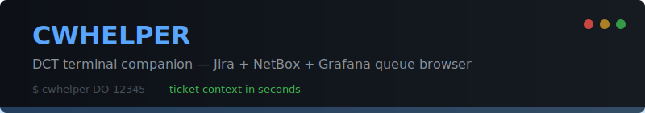

<p align="center">
  
</p>

<p align="center">
  
  
  
  
  
</p>

<p align="center">
  <b>DCT terminal companion</b> — look up tickets, browse queues, trace cables, and manage your shift from one CLI.
</p>

---

<!-- TODO: record with `vhs assets/tapes/hero.tape` -->
<!--  -->

## Install

> **One command. Zero config files to edit manually.**

```bash
curl -sL https://raw.githubusercontent.com/rpatino-cw/cw-node-helper/main/install.sh | bash
```

This clones the repo, installs dependencies, runs the setup wizard, discovers your sites from Jira, and enables all features. You'll be looking up tickets in under 60 seconds.

<details>
<summary><b>Manual install</b></summary>

```bash
git clone -b rpatino/cw-node-helper https://github.com/rpatino-cw/cw-node-helper.git
cd cw-node-helper
pip install -e .
cwhelper setup
cwhelper
```

</details>

<details>
<summary><b>What you'll need</b></summary>

- Python 3.10+
- A Jira API token — [generate one here](https://id.atlassian.com/manage-profile/security/api-tokens)
- Your Jira email address
- (Optional) NetBox API URL and token

</details>

---

## How It Works

```
                    cwhelper
                       │
          ┌────────────┼────────────┐
          │            │            │
       Ticket       Queue       Doctor
      Lookup       Browser      Check
          │            │            │
     ┌────┴────┐   ┌───┴───┐   ┌───┴───┐
     │  Jira   │   │ Jira  │   │ .env  │
     │ NetBox  │   │ Site  │   │ APIs  │
     │Grafana  │   │Filter │   │ Auth  │
     └─────────┘   └───────┘   └───────┘
```

Type a ticket key, service tag, or hostname at the prompt. cwhelper pulls context from Jira, enriches it with NetBox device data, and gives you everything you need on one screen: **where** the device is, **what** to do, and **which** device to touch.

---

## Usage

```bash
cwhelper                          # interactive menu
cwhelper DO-12345                 # look up a ticket
cwhelper 10NQ724                  # search by service tag
cwhelper queue --site US-EAST-03  # browse open tickets
cwhelper doctor                   # health check
cwhelper config                   # toggle features
cwhelper update                   # pull latest version
cwhelper -h                       # full help
```

---

## Features

Every feature can be toggled on/off. Only what you need, nothing you don't.

```bash
cwhelper config                   # see what's enabled
cwhelper config --enable queue    # enable one feature
cwhelper config --enable-all      # enable everything
```

<table>
<tr>
<td width="50%" valign="top">

### Ticket Lookup

<!--  -->

Type `DO-12345` at the prompt. Get the full picture:
- Location breadcrumb (Site > DH > Rack > RU)
- Status, assignee, age, SLA timers
- NetBox device data + Grafana links
- Linked tickets, comments, diagnostics
- One-key actions: start, verify, hold, close

</td>
<td width="50%" valign="top">

### Queue Browser

<!--  -->

Browse DO, HO, or SDA tickets filtered by site and status. Color-coded by age. Stale tickets flagged automatically.

```
1  Browse queue    DO / HO / SDA
2  My tickets      stale > 48h flagged
3  Watch queue     background alerts
```

</td>
</tr>
<tr>
<td width="50%" valign="top">

### Setup Wizard

<!--  -->

`cwhelper setup` walks you through everything:
- Prompts for Jira + NetBox credentials
- Tests API connectivity live
- Auto-discovers your site codes from Jira
- Offers to enable all features
- Writes `.env` with `chmod 600`

</td>
<td width="50%" valign="top">

### Doctor & Config

<!--  -->

```bash
$ cwhelper doctor
  ✓  Python              3.12.0
  ✓  .env file           /path/.env
  ✓  Jira credentials    you@company.com
  ✓  Jira API            https://org.atlassian.net
  ✓  NetBox API          https://netbox.example.com
  ✓  Known sites         18 configured
  ✓  Features            17/17 enabled

  All checks passed!
```

</td>
</tr>
<tr>
<td width="50%" valign="top">

### Rack Map

<!--  -->

ASCII data hall visualization with animated walking route to your rack. See your position on the floor without leaving the terminal.

</td>
<td width="50%" valign="top">

### Shift Brief

AI-generated priority summary from your live queue. Tells you what to work on first based on ticket age, SLA, and severity.

```bash
cwhelper brief --site US-EAST-03
```

</td>
</tr>
</table>

<details>
<summary><b>All 17 features</b></summary>

| Feature | CLI | Menu | Dependencies |
|---------|-----|------|-------------|
| Ticket lookup | `DO-12345` | direct input | Jira, NetBox |
| Queue browser | `queue` | `1` | Jira |
| My tickets | — | `2` | Jira |
| Queue watcher | `watch` | `3` | Jira |
| Rack map | — | `4` | NetBox |
| Bookmarks | — | `5` | Jira |
| Shift brief | `brief` | `b` | Jira, AI |
| Bulk start | — | `p` / `P` | Jira |
| Activity log | — | `l` | Jira |
| Walkthrough | — | `w` | Jira, NetBox |
| Rack report | `rack-report` | `r` | Jira |
| Code quiz | `learn` | `L` | none |
| AI chat | — | `ai` | OpenAI |
| Node history | `history` | — | Jira |
| Verification | `verify` | — | Jira, NetBox |
| IB trace | `ibtrace` | — | local topology |
| Weekend assign | `weekend-assign` | — | Jira |

</details>

---

## Ticket View Hotkeys

After opening a ticket, these hotkeys are available:

<table>
<tr>
<td width="50%">

**View**
| Key | Action |
|-----|--------|
| `r` | Rack map + walking route |
| `n` | Network connections |
| `l` | Linked tickets |
| `d` | Diagnostics |
| `c` | Comments |
| `e` | Rack elevation view |
| `f` | MRB / Parts search |

</td>
<td width="50%">

**Actions**
| Key | Action |
|-----|--------|
| `s` | Start work (grab + In Progress) |
| `v` | Move to Verification |
| `y` | Put On Hold |
| `z` | Resume (back to In Progress) |
| `k` | Close ticket |
| `j` | Open in Jira |
| `g` | Open Grafana dashboard |

</td>
</tr>
</table>

**Navigation:** `b` back &nbsp; `m` menu &nbsp; `h` history &nbsp; `q` quit

---

## Troubleshooting

```bash
cwhelper doctor    # first thing to run
```

| Problem | Fix |
|---------|-----|
| `Missing: JIRA_EMAIL` | Run `cwhelper setup` |
| `Jira unreachable` | Check VPN/network, verify API token |
| `Feature disabled` | Run `cwhelper config --enable <feature>` |
| `cwhelper: command not found` | `export PATH="$HOME/.local/bin:$PATH"` |
| Stale version | Run `cwhelper update` |

---

## Development

```bash
python3 test_integrity.py    # 176 tests, all API calls mocked
python3 test_map.py          # rack visualization tests
```

**Recording GIFs** (requires [vhs](https://github.com/charmbracelet/vhs)):

```bash
vhs assets/tapes/hero.tape       # main demo
vhs assets/tapes/setup.tape      # setup wizard
vhs assets/tapes/config.tape     # config + doctor
```

---

## Project Structure

```
cwhelper/
  cli.py              entry point + subcommand routing
  config.py           constants, feature flags, 17-feature registry
  clients/            API clients (Jira, NetBox, Grafana)
  services/           business logic (queue, search, AI, verify)
  tui/                terminal UI (menu, display, settings, actions)
    settings.py       feature toggle Rich TUI
    rich_console.py   shared Rich console + rendering
test_integrity.py     176 tests, all mocked
install.sh            one-command installer
```

---

<p align="center">
  <sub>Built for DCT operations. MIT License.</sub>
</p>
